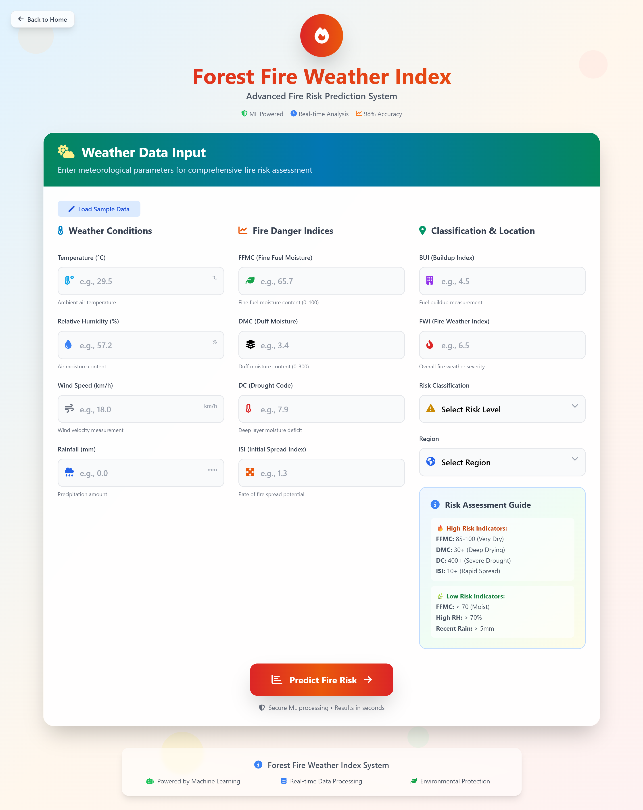

# 🌲 Algerian Forest Fire Prediction System

A machine learning web application that predicts the **Fire Weather Index (FWI)** — a critical measure of forest fire risk — based on weather and environmental conditions in two regions of Algeria: **Bejaia** and **Sidi Bel-Abbes**.

This project combines **data cleaning**, **exploratory data analysis (EDA)**, **regression modeling**, and a **Flask-based web interface** to deliver real-time fire risk predictions.

---

## 📌 Table of Contents
- [Project Overview](#-project-overview)
- [Dataset](#-dataset)
- [Key Features](#-key-features)
- [Exploratory Data Analysis (EDA)](#-exploratory-data-analysis-eda)
- [Model Training](#-model-training)
- [Flask Web Application](#-flask-web-application)
- [How to Run the App](#-how-to-run-the-app)
- [Folder Structure](#-folder-structure)
- [Dependencies](#-dependencies)

---

## 🚀 Project Overview

This system predicts the **Fire Weather Index (FWI)** using a **Ridge Regression model** trained on real weather data collected from June to September 2012. The FWI is a continuous index that reflects the potential for fire spread and intensity.

While the original dataset includes a binary label (`fire` / `not fire`), this project treats **FWI prediction as a regression task**, enabling more granular fire risk assessment.

The trained model is deployed via a **Flask web application**, where users can input weather parameters and get an instant FWI prediction.

---

## 📂 Dataset

- **Name**: Algerian Forest Fires Dataset
- **Source**: [Kaggle](https://www.kaggle.com/datasets/zakopur0/algerian-forest-fires-dataset) / UCI ML Repository
- **Time Period**: June – September 2012
- **Instances**: 244 (122 from Bejaia, 122 from Sidi Bel-Abbes)
- **Features**:
  - `Temperature`: Temperature in °C
  - `RH`: Relative Humidity (%)
  - `Ws`: Wind Speed (km/h)
  - `Rain`: Rainfall (mm)
  - `FFMC`, `DMC`, `DC`, `ISI`, `BUI`, `FWI`: Components of the Canadian Forest Fire Weather Index (FWI) System
  - `Classes`: 0 = "not fire", 1 = "fire"
  - `Region`: 0 = Bejaia, 1 = Sidi Bel-Abbes
- **Target Variable**: `FWI` (predicted as a continuous value)

---

## 🔍 Key Features

- Data cleaning and region-based splitting
- Removal of multicollinear features (correlation > 85%)
- Feature scaling using `StandardScaler`
- Model comparison: Linear, Lasso, Ridge, ElasticNet
- Best-performing model: **Ridge Regression with Cross-Validation**
- Web interface for real-time predictions

---

## 📊 Exploratory Data Analysis (EDA)

Key insights from EDA:
- Most fires occurred in **July and August**, especially in high temperatures.
- Positive correlation between **temperature**, **ISI**, **FWI**, and fire occurrence.
- Data was cleaned by:
  - Removing nulls and invalid rows
  - Adding `Region` column
  - Converting data types
  - Saving cleaned version: `Algerian_forest_fires_cleaned_dataset.csv`

Visualizations included:
- Histograms of all features
- Correlation heatmap
- Box plots for outlier detection
- Monthly fire count by region

---

## ⚙️ Model Training

### Preprocessing
- Dropped `day`, `month`, `year` columns
- Removed highly correlated features (>85%)
- Scaled features using `StandardScaler`

### Models Trained
| Model | MAE | R² Score |
|------|-----|---------|
| Linear Regression | ~1.8 | ~0.72 |
| Lasso | ~1.9 | ~0.70 |
| **Ridge (Best)** | **~1.7** | **~0.75** |
| ElasticNet | ~1.8 | ~0.71 |

✅ **Final Model**: `RidgeCV` (5-fold CV)  
✅ **Saved as**: `models/ridge.pkl`  
✅ **Scaler**: `models/scaler.pkl`

---

## 🖥️ Flask Web Application

The Flask app provides a user-friendly interface to predict FWI values.

### 🔗 Routes
- `GET /` → Landing page (`index.html`)
- `GET /home` → Prediction form page
- `POST /predictdata` → Accepts form data, returns FWI prediction

### 📥 Input Fields
Users input:
- Temperature, RH, Wind Speed, Rain
- FFMC, DMC, ISI
- Classes (0 or 1)
- Region (0 or 1)

### 🧠 Prediction Flow
1. Input → collected via HTML form
2. Scaled using `StandardScaler`
3. Predicted using trained `Ridge` model
4. Result → displayed on `home.html`

---

## ▶️ How to Run the App

### Prerequisites
- Python 3.8+
- Pip package manager

### Steps

1. **Clone the repository**

2. **Create and activate virtual environment (optional but recommended)**
   ```bash
   python -m venv env
   source env/bin/activate    # Linux/Mac
   # or
   env\Scripts\activate       # Windows
   ```

3. **Install dependencies**
   ```bash
   pip install -r requirements.txt
   ```

4. **Run the Flask app**
   ```bash
   python app.py
   ```

5. **Open in browser**
   ```
   http://127.0.0.1:5000
   ```

---

## 📁 Folder Structure

```
algerian-forest-fire-prediction/
│
├── data/
│   ├── Algerian_forest_fires_dataset.csv
│   └── Algerian_forest_fires_cleaned_dataset.csv
│
├── models/
│   ├── ridge.pkl
│   └── scaler.pkl
│
├── notebooks/
│   ├── eda.ipynb
│   └── model_training.ipynb
│
├── templates/
│   ├── index.html
│   └── home.html
│
├── application.py
├── requirements.txt
└── README.md
```

---

## 🔧 Dependencies

Install using:
```bash
pip install flask scikit-learn pandas numpy seaborn matplotlib
```

### `requirements.txt`
```txt
Flask==2.3.3
scikit-learn==1.3.0
pandas==2.0.3
numpy==1.24.3
seaborn==0.12.2
matplotlib==3.7.2
```

## 🙌 Acknowledgments

- Dataset contributors from Kaggle and UCI ML Repository
- Scikit-learn, Flask, and Python open-source communities

---

## 📸 Screenshots (Optional)



---
